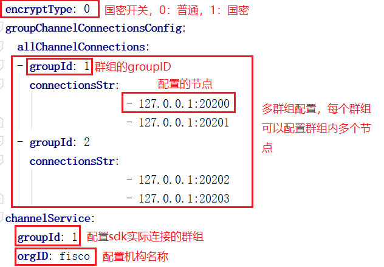

# Spring Boot Starter

该项目是基于FISCO-BCOS Java SDK的spring boot版本的示例项目，提供FISCO BCOS区块链应用开发的基本框架，并提供基本的Java SDK测试案例，帮助开发者基于FISCO BCOS区块链快速进行应用开发。此版本只支持[FISCO BCOS 2.0](https://fisco-bcos-documentation.readthedocs.io/zh_CN/release-2.0/docs/introduction.html)

## 1 快速启动

### 1.1 前置条件
搭建FISCO BCOS区块链，具体步骤[参考这里](https://fisco-bcos-documentation.readthedocs.io/zh_CN/feature-2.0.0/docs/manual/hello_world.html#hello-world)。


### 1.2 配置

### 1.2.1 获取源码
```
git clone https://github.com/FISCO-BCOS/spring-boot-starter.git
```
#### 1.2.2 FISCO BCOS节点证书配置
FISCO-BCOS作为联盟链，其SDK连接节点需要进行双向认证。因此，需要将节点所在目录nodes/${ip}/sdk下的ca.crt、node.crt和node.key文件拷贝到项目的src/test/resources目录下供SDK使用。

#### 1.2.3 配置文件设置
spring boot项目的配置文件application.yml如下图所示，其中红框标记的内容根据区块链节点配置做相应修改。
  
   

配置项详细说明:
- encryptType: 国密算法开关(默认为0)
  - 0: 不使用国密算法发交易
  - 1: 使用国密算法发交易(开启国密功能，需要连接的区块链节点是国密节点，搭建国密版FISCO BCOS区块链[参考这里](https://fisco-bcos-documentation.readthedocs.io/zh_CN/feature-2.0.0/docs/manual/guomi.html))
- groupChannelConnectionsConfig:
  - 配置待连接的群组，可以配置一个或多个群组，每个群组需要配置群组ID。
  - 每个群组可以配置一个或多个节点，设置群组节点的配置文件config.ini中[rpc]部分的listen_ip和channel_listen_port。
- channelService: 通过指定群组ID配置SDK实际连接的群组，指定的群组ID是groupChannelConnectionsConfig配置中的群组ID。SDK会与群组中配置的节点均建立连接，然后随机选择一个节点发送请求。

### 1.3 运行
编译并运行测试案例，在项目根目录下运行：
```
gradle build
```
当所有测试案例运行成功，则代表区块链运行正常，该项目通过SDK连接区块链正常。开发者可以基于该项目进行具体应用开发。

## 2 测试案例介绍

该示例项目提供[Java SDK](https://fisco-bcos-documentation.readthedocs.io/zh_CN/feature-2.0.0/docs/introduction.html)的使用测试案例，供开发者参考使用。测试案例主要分为对Web3j API，Precompiled Serveice API、Solidity合约文件转Java合约文件、部署和调用合约的测试。

### 2.1 Web3j API测试
提供Web3jApiTest测试类测试Web3j API。示例测试如下：
```
  @Test
  public void getBlockNumber() throws IOException {
      BigInteger blockNumber = web3j.getBlockNumber().send().getBlockNumber();
      System.out.println(blockNumber);
      assertTrue(blockNumber.compareTo(new BigInteger("0"))>= 0);
  }
```
**温馨提示：** Application类初始化了web3j对象，在业务代码需要的地方可用注解的方式直接使用，使用方式如下：
  ```
    @Autowired
    private Web3j web3j
  ```

### 2.2 Precompiled Service API测试
提供PrecompiledServiceApiTest测试类测试Precompiled Service API。示例测试如下：
```API
    @Test
    public void testSystemConfigService() throws Exception {
        SystemConfigSerivce systemConfigSerivce = new SystemConfigSerivce(web3j, credentials);
        systemConfigSerivce.setValueByKey("tx_count_limit", "2000");
        String value = web3j.getSystemConfigByKey("tx_count_limit").send().getSystemConfigByKey();
        System.out.println(value);
        assertTrue("2000".equals(value));
    }
```

### 2.3 Solidity合约文件转Java合约文件测试
提供SolidityFunctionWrapperGeneratorTest测试类测试Solidity合约文件转Java合约文件。示例测试如下：
```API
    @Test
    public void compileSolFilesToJavaTest() throws IOException {
        File solFileList = new File("src/test/resources/contract");
        File[] solFiles = solFileList.listFiles();

        for (File solFile : solFiles) {

            SolidityCompiler.Result res = SolidityCompiler.compile(solFile, true, ABI, BIN, INTERFACE, METADATA);
            System.out.println("Out: '" + res.output + "'");
            System.out.println("Err: '" + res.errors + "'");
            CompilationResult result = CompilationResult.parse(res.output);
            System.out.println("contractname  " + solFile.getName());
            Path source = Paths.get(solFile.getPath());
            String contractname = solFile.getName().split("\\.")[0];
            CompilationResult.ContractMetadata a = result.getContract(solFile.getName().split("\\.")[0]);
            System.out.println("abi   " + a.abi);
            System.out.println("bin   " + a.bin);
            FileUtils.writeStringToFile(new File("src/test/resources/solidity/" + contractname + ".abi"), a.abi);
            FileUtils.writeStringToFile(new File("src/test/resources/solidity/" + contractname + ".bin"), a.bin);
            String binFile;
            String abiFile;
            String tempDirPath = new File("src/test/java/").getAbsolutePath();
            String packageName = "org.fisco.bcos.temp";
            String filename = contractname;
            abiFile = "src/test/resources/solidity/" + filename + ".abi";
            binFile = "src/test/resources/solidity/" + filename + ".bin";
            SolidityFunctionWrapperGenerator.main(Arrays.asList(
                    "-a", abiFile,
                    "-b", binFile,
                    "-p", packageName,
                    "-o", tempDirPath
            ).toArray(new String[0]));
        }
        System.out.println("generate successfully");
    }
```
该测试案例将src/test/resources/contract目录下的所有Solidity合约文件(默认提供HelloWorld合约)均转为相应的abi和bin文件，保存在src/test/resources/solidity目录下。然后将abi文件和对应的bin文件组合转换为Java合约文件，保存在src/test/java/org/fisco/bcos/temp目录下。SDK将利用Java合约文件进行合约部署与调用。

### 2.4 部署和调用合约测试
提供ContractTest测试类测试部署和调用合约。示例测试如下：
```
    @Test
    public void deployAndCallHelloWorld() throws Exception {
        //deploy contract
        HelloWorld helloWorld = HelloWorld.deploy(web3j, credentials, new StaticGasProvider(gasPrice, gasLimit)).send();
        if (helloWorld != null) {
            System.out.println("HelloWorld address is: " + helloWorld.getContractAddress());
            //call set function
            helloWorld.set("Hello, World!").send();
            //call get function
            String result = helloWorld.get().send();
            System.out.println(result);
            assertTrue( "Hello, World!".equals(result));
        }
    }
```

## 3 相关链接
- 了解FISCO BCOS项目，请参考[FISCO BCOS文档](https://fisco-bcos-documentation.readthedocs.io/zh_CN/release-2.0/docs/introduction.html)。
- 了解FISCO BCOS的Java SDK，请参考[web3sdk文档](https://fisco-bcos-documentation.readthedocs.io/zh_CN/release-2.0/docs/sdk/sdk.html)。
- 了解spring boot，请参考[Spring Boot官网](https://spring.io/guides/gs/spring-boot/)。